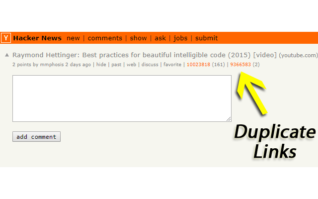

Hacker News Duplicate Detector
==============================

*Hacker News Duplicate Detector* (HNDD) is a Google Chrome extension that automatically
detects duplicate Hacker News (HN) submissions.

It is available from the Google Chrome Web Store:
https://chrome.google.com/webstore/detail/hacker-news-duplicate-det/ocagpmnfhgbgmbaaimpehpbnnplkmpkd

To use HNDD, install the extension, and it will work automatically on relevant HN pages.

Screenshot
----------

The following image shows the results produced by HNDD on a duplicate HN submission page.

License
-------

See [LICENSE](LICENSE).

Acknowledgments
---------------

HNDD uses Algolia's [HN Search API](https://hn.algolia.com/api).
