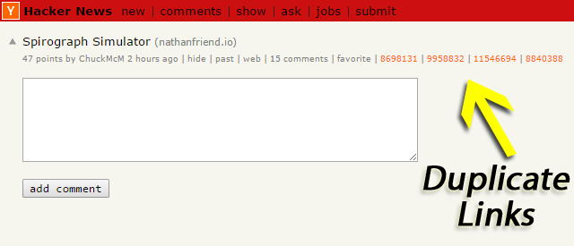

[![build][badge_thumbnail]][badge_link]

Hacker News Duplicate Detector
==============================

*Hacker News Duplicate Detector* (HNDD) is a Google Chrome extension that automatically
detects duplicate Hacker News (HN) submissions.

It is available from the Google Chrome Web Store:
https://chrome.google.com/webstore/detail/hacker-news-duplicate-det/ocagpmnfhgbgmbaaimpehpbnnplkmpkd

To use HNDD, install the extension, and it will work automatically on relevant HN pages.

Screenshot
----------

The following image shows the links produced by HNDD on a duplicate HN submission page.

Development
-----------

A different `manifest.json` is used for Chrome and Firefox. For development, create a symbolic link
`manifest.json` that points to either `manifest_chrome.json` or `manifest_firefox.json`, depending
on the environment.

To generate zip archives, run `zip.sh`.

License
-------

See [LICENSE](LICENSE).

Acknowledgments
---------------

HNDD uses Algolia's [HN Search API](https://hn.algolia.com/api).

[badge_link]: https://github.com/dstein64/hn-duplicate-detector/actions/workflows/build.yml
[badge_thumbnail]: https://github.com/dstein64/hn-duplicate-detector/actions/workflows/build.yml/badge.svg
